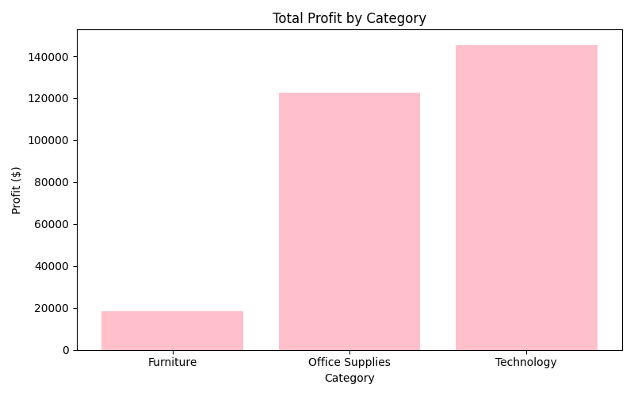
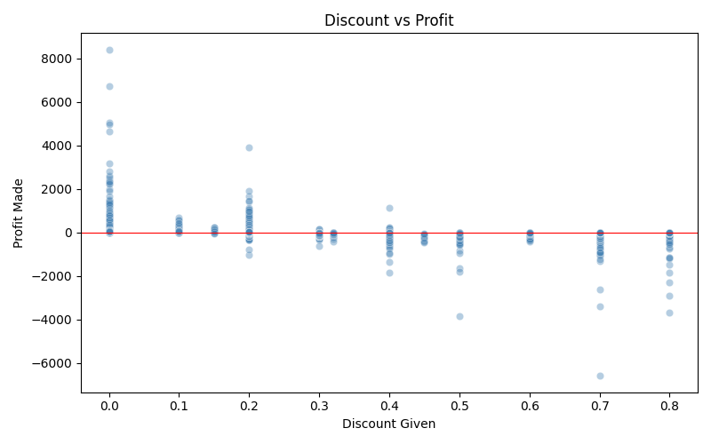
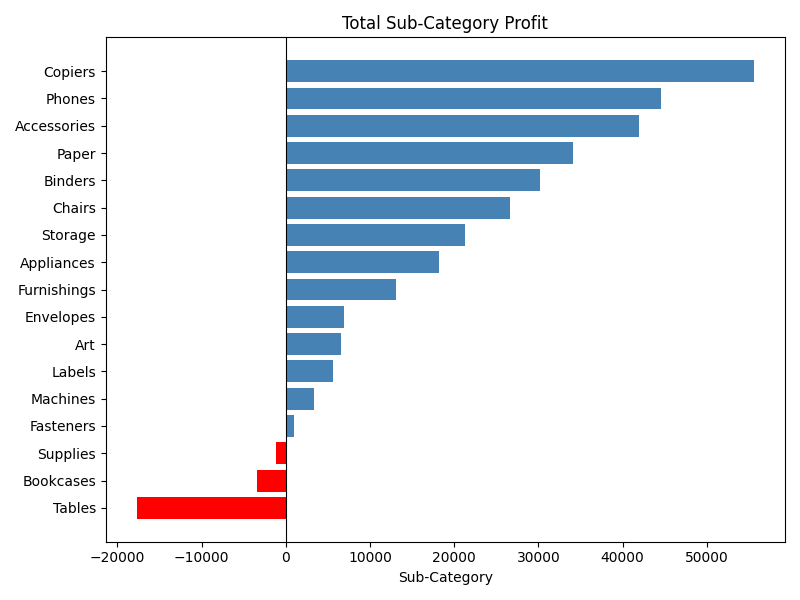

# E-Commerce Sales Analysis 📊

Exploratory data analysis on real e-commerce sales data using Python and pandas.
Analysed 9,994 orders across 4 regions, 3 categories and 49 states.

## Key Findings
- 💰 Total Revenue: $2,297,200 | Profit Margin: 12.5%
- 🏆 Technology is the most profitable category ($145,454 profit)
- 📦 Furniture has high sales but nearly zero profit margin
- ❌ Tables, Bookcases and Supplies are loss-making products
- 🔻 Discounts above 20% consistently cause losses
- 🌍 West region leads in total sales ($725,457)

## Business Recommendations
1. Stop discounts above 20% — data shows it directly causes losses
2. Review pricing for Tables and Bookcases — currently sold at a loss
3. Invest more in Technology — highest profit margin category
4. Focus marketing on West and East regions — highest returns

## Project Structure
ecommerce-sales-analysis/
├── notebook/
│   ├── 01_loading_data.ipynb
│   ├── 02_exploring_data.ipynb
│   ├── 03_visualisations.ipynb
│   ├── 04_deep_analysis.ipynb
│   └── 05_summary_insights.ipynb
├── images/
│   ├── profit_by_category.png
│   ├── discount_vs_profit.png
│   ├── subcat_profit.png
│   └── top_states.png
└── README.md

## Charts

### Profit by Category

### Discount vs Profit

### Sub-Category Profit

## Tools Used
- Python, pandas, matplotlib, seaborn, Jupyter Notebook

## Dataset
- Source: Kaggle — Sample Superstore Dataset
- 9,994 rows | 21 columns | No missing values
